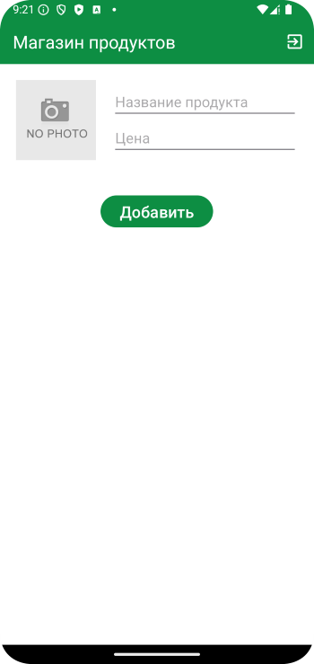
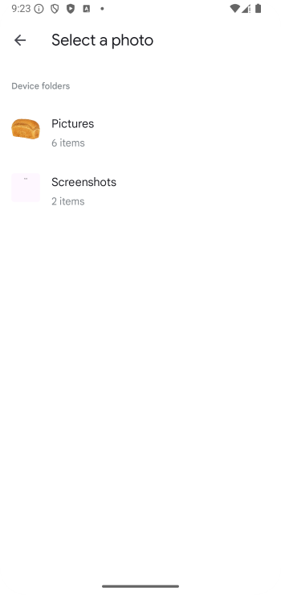
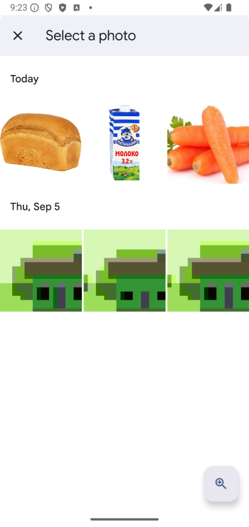
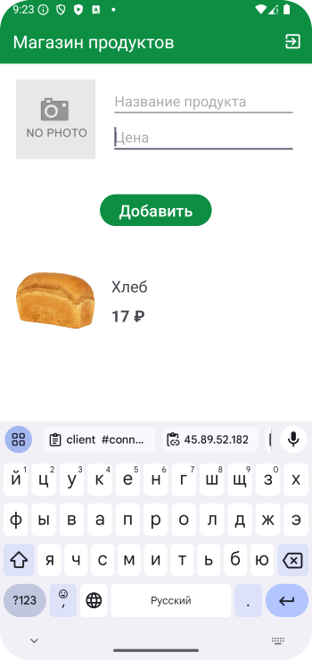
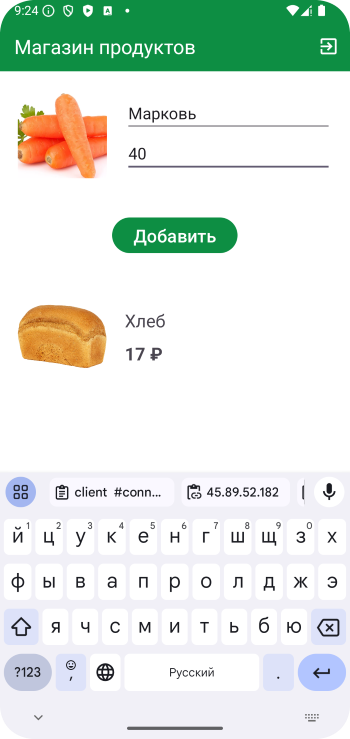
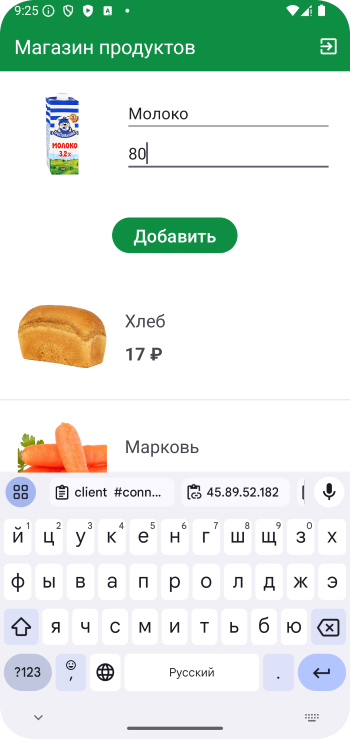
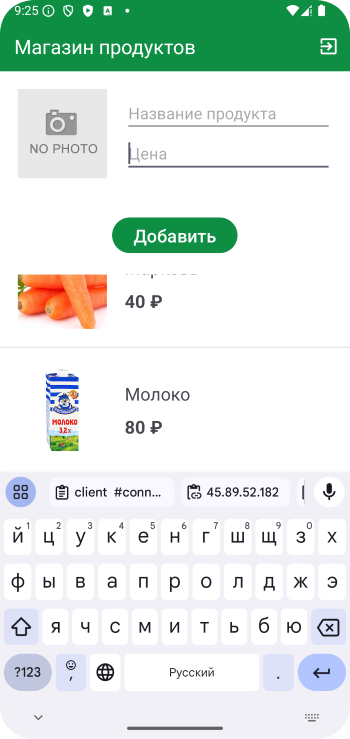
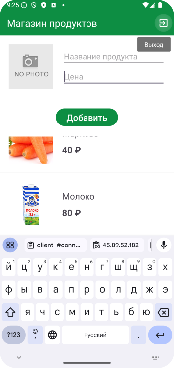

# Домашнее задание по теме "CustomListView"

### Приложение «Магазин продуктов»

Создаем приложение магазина пищевых продуктов. Вы выступаете в роли создателя этого магазина путем заполнения его ассортиментом продуктов. В приложении несколько экранов, экран запуска и приветствия, экран самого магазина куда продукт добавляется в список с картинкой продукта, названием и цены. Желательно в смартфон скачать несколько картинок продуктов, которые войдут в ассортимент продуктов магазина. Картинка должна добавляться из галереи телефона. На последнем экране есть возможность выйти из приложения.

Для работы приложения необходимо создать:

На первом экране:

1. Текстовое поле приветствия **«Магазин продуктов»**.

2. Кнопка **«Создать магазин»**.

На втором экране:

1. Поле ввода названия продукта.

2. Поле ввода цены продукты.

3. Поле для размещения фото(картинки) продукта.

4. Кнопка для добавления продукта в список **«Добавить»**.

5. Список добавленных продуктов магазина. В элементе списка должны находиться фото продукта, название и цена.

6. Меню с пунктом выхода из приложения **«Exit»**.

Приложение необходимо сохранить проектом в удаленном репозитории, для проверки качества предоставить ссылку преподавателю, либо сделать видео экрана реального устройства в процессе работы приложения.

### Скриншоты к домашнему заданию по теме "CustomListView"

Здесь скриншоты

