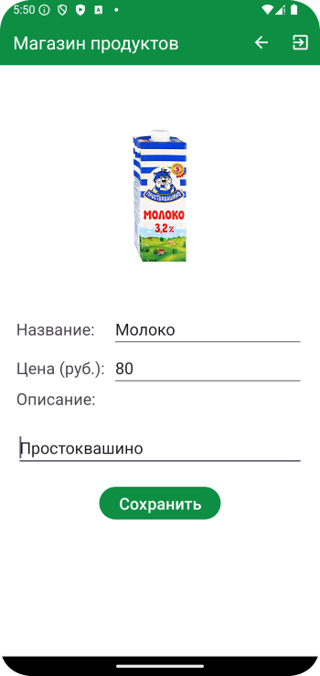

# Домашнее задание по теме "CustomListView"

### Приложение «Магазин продуктов»

Создаем приложение магазина пищевых продуктов. Вы выступаете в роли создателя этого магазина путем заполнения его ассортиментом продуктов. В приложении несколько экранов, экран запуска и приветствия, экран самого магазина куда продукт добавляется в список с картинкой продукта, названием и цены. Желательно в смартфон скачать несколько картинок продуктов, которые войдут в ассортимент продуктов магазина. Картинка должна добавляться из галереи телефона. На последнем экране есть возможность выйти из приложения.

Для работы приложения необходимо создать:

На первом экране:

1. Текстовое поле приветствия **«Магазин продуктов»**.

2. Кнопка **«Создать магазин»**.

На втором экране:

1. Поле ввода названия продукта.

2. Поле ввода цены продукты.

3. Поле для размещения фото(картинки) продукта.

4. Кнопка для добавления продукта в список **«Добавить»**.

5. Список добавленных продуктов магазина. В элементе списка должны находиться фото продукта, название и цена.

6. Меню с пунктом выхода из приложения **«Exit»**.

Приложение необходимо сохранить проектом в удаленном репозитории, для проверки качества предоставить ссылку преподавателю, либо сделать видео экрана реального устройства в процессе работы приложения.

### Скриншоты к домашнему заданию по теме "CustomListView"

Здесь скриншоты

# Домашнее задание по теме "CustomListView 2 часть"

### Приложение «Магазин продуктов»

Дорабатываем приложение магазина пищевых продуктов.

Полная реализация с учетом предыдущей:

Вы выступаете в роли создателя этого магазина путем заполнения его ассортиментом продуктов. В приложении несколько экранов, экран запуска и приветствия, экран самого магазина куда продукт добавляется в список с картинкой продукта, названием и цены. Желательно в смартфон скачать несколько картинок продуктов, которые войдут в ассортимент продуктов магазина. Картинка должна добавляться из галереи телефона. **По нажатию на элемент списка продуктов выполняется переход на экран детализации продукта с описанием его там. На втором и третьем экранах есть возможность выйти из приложения.**

Для работы приложения необходимо создать:

На первом экране:

1. Текстовое поле приветствия «Магазин продуктов».

2. Кнопка «Создать магазин».

На втором экране:

1. Поле ввода названия продукта.

2. Поле ввода цены продукты.

3. Поле для размещения фото(картинки) продукта.

4. Поле краткого описания продукта.

5. Кнопка для добавления продукта в список «Добавить».

6. Список добавленных продуктов магазина. В элементе списка должны находиться фото продукта, название и цена.

7. Меню с пунктом выхода из приложения «Exit».

На третьем экране:

1. Поле размещения фото продукта в более крупном формате.

2.  Поле названия продукта.

3.  Поле цены продукта.

4. Поле краткого описания продукта.

5.  Меню с пунктом выхода из приложения «Exit».

Приложение необходимо сохранить проектом в удаленном репозитории, для проверки качества предоставить ссылку преподавателю, либо сделать видео экрана реального устройства в процессе работы приложения.

### Скриншоты к домашнему заданию по теме "CustomListView часть 2"

Здесь скриншоты

# Домашнее задание по теме "CustomListView 3 часть"

### Приложение «Магазин продуктов»

Дорабатываем приложение магазина пищевых продуктов.

Полная реализация с учетом предыдущей:

Вы выступаете в роли создателя этого магазина путем заполнения его ассортиментом продуктов. В приложении несколько экранов, экран запуска и приветствия, экран самого магазина куда продукт добавляется в список с картинкой продукта, названием и цены. Желательно в смартфон скачать несколько картинок продуктов, которые войдут в ассортимент продуктов магазина. Картинка должна добавляться из галереи телефона. По нажатию на элемент списка продуктов выполняется переход на экран детализации продукта с описанием его там. **На экране детализации по нажатию на ImageView есть возможность обратиться к галерее и поменять картинку. На экране детализации есть возможность вернуться на главный экран через пункт меню «Back». На главном экране и экране детализации есть возможность выйти из приложения. Выход сопровождается всплывающим сообщением «Программа завершена»**.

Для работы приложения необходимо создать:

**На первом экране:**

1. Текстовое поле приветствия «Магазин продуктов».

2. Кнопка «Создать магазин».

**На втором экране:**

1. Поле ввода названия продукта.

2. Поле ввода цены продукты.

3. Поле для размещения фото(картинки) продукта.

4. Кнопка для добавления продукта в список «Добавить».

5. Список добавленных продуктов магазина. В элементе списка должны находиться фото продукта, название и цена.

6. Поле краткого описания продукта.

7. Меню с пунктом «Exit».

**На третьем экране:**

1. Поле размещения фото продукта в более крупном формате.

2. Поле названия продукта.

3. Поле цены продукта.

4. Поле краткого описания продукта.

5.  Меню с пунктами:

    1. Выхода из приложения «Exit».

    2. Переход на экран списка продуктов «Back» (реализация возможна через intent).

Приложение необходимо сохранить проектом в удаленном репозитории, для проверки качества предоставить ссылку преподавателю, либо сделать видео экрана реального устройства в процессе работы приложения.

### Скриншоты к домашнему заданию по теме "CustomListView часть 3"

Здесь скриншоты

